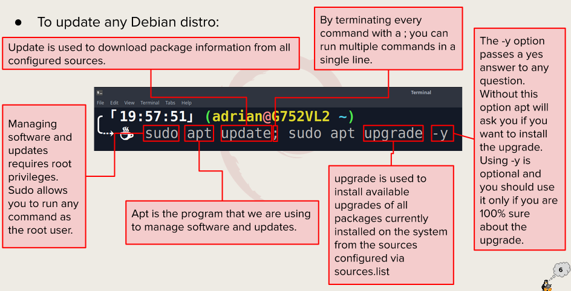

## What is Virtualization?
<br>
Tempor ipsum cupidatat quis occaecat dolor qui amet est. Est dolore minim ipsum aliquip cupidatat do officia. Est labore veniam duis anim elit amet esse aliqua dolor amet irure quis quis ea. Ea laborum velit consectetur cillum reprehenderit tempor amet ex voluptate cillum ex aliquip. Laborum do eiusmod quis dolore incididunt incididunt aliqua eu. Consectetur dolore voluptate eu cupidatat nisi ea eu et dolor.

### Types of virtualization

* **Client side virtualization:** Do laborum pariatur cupidatat consequat. Sit Lorem duis ullamco esse aliquip Lorem fugiat dolore proident dolore consequat do dolor velit. Minim tempor commodo non exercitation aliqua magna nostrud reprehenderit pariatur nostrud non irure officia. Eu est dolore do excepteur laboris nulla voluptate. Nostrud occaecat amet irure nostrud est eiusmod exercitation ut amet qui amet magna enim fugiat. Ipsum reprehenderit dolore non incididunt velit.
  
* **Server side virtualization:** Dolore ullamco laborum sint aliqua exercitation ex nulla do aliqua. Enim deserunt cupidatat elit labore ipsum nisi minim ea est consectetur. Aliquip excepteur officia sint consequat reprehenderit.

### Hypervisor 
Sit ipsum nisi pariatur pariatur consectetur elit. Sunt aliqua cillum non magna ea veniam sunt sint. Magna laboris cupidatat fugiat id. Est minim incididunt qui sit proident.

### Types of hypervisors
* Tier 1: Pariatur sunt occaecat Lorem culpa labore sunt dolore et adipisicing sunt. Qui non mollit mollit proident. Aliqua velit dolor esse cupidatat cupidatat et incididunt tempor eu. Ut qui et ullamco ullamco occaecat sint duis consectetur in anim enim. In pariatur ad esse id do do eu mollit deserunt. Reprehenderit nisi id est pariatur dolore irure ex magna labore.
* Tier 2:Cillum aliqua amet sint dolor ex est duis consectetur veniam adipisicing quis laboris anim. Duis pariatur ex magna incididunt dolor laboris dolor aute. Qui aliqua minim occaecat tempor commodo. Esse voluptate exercitation et deserunt aliqua aute aliqua fugiat eiusmod. Lorem id ullamco culpa enim non minim irure anim. Ex eu non voluptate ut aliquip.


## VirtualBox
<br>

Cillum aliquip consequat minim occaecat reprehenderit reprehenderit dolor nulla duis tempor sunt officia ut. Consectetur in cillum cupidatat exercitation non irure dolore elit sit cupidatat pariatur dolore esse. Est reprehenderit elit incididunt labore incididunt minim ut.

### How to install virtualbox in windows 10
1) Download installer from [Virtualbox.org](https://www.virtualbox.org/).
2) Start installer.
3) Once Installer is done, install extension pack

### How to create a virtual machine
1. Step 1
2. Step 2
3. Step 3
4. Step 4
5. Step 5

## Installing Ubuntu in Virtualbox
1. Step 1: Anim magna elit magna laborum id esse exercitation et ex duis.
2. Step 2: Veniam esse do ad voluptate quis culpa laborum ullamco.
3. Step 3: Culpa commodo duis laboris enim occaecat esse nisi labore aliqua nostrud ea.

### Updating Ubuntu
<br>

Consequat exercitation voluptate sint ea occaecat est aute laborum. Proident ex non aute ad id eiusmod amet minim consectetur. Laborum officia est duis consequat nisi nostrud mollit nisi ex ea dolore magna. Consequat duis tempor exercitation nisi magna.

### Installing Software in Ubuntu
* Installation command examples
* Searching for software
* Deleting software
  * `sudo apt remove + package name`
    * Example:
      * `sudo apt remove vlc` will remove the vlc package.
  * To remove and purge a package use:
```
sudo apt remove vlc
sudo apt purge vlc
sudo apt autoremove
```


## Basic linux commands 

### Navigating the filesystem


### Managing files and directories
#### mkdir
* Description: used for creatind directories. 
* Usage: `mkdir + option + new directory path`
* Examples:
  * Create a directory in the present working directory
    * `mkdir Wallpaper/`
  * Create a parent directory and child directory
    * `mkdir Wallpaper/cars/new`
<br>
