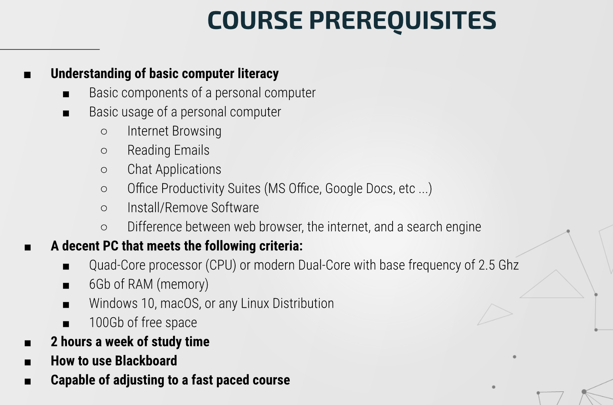
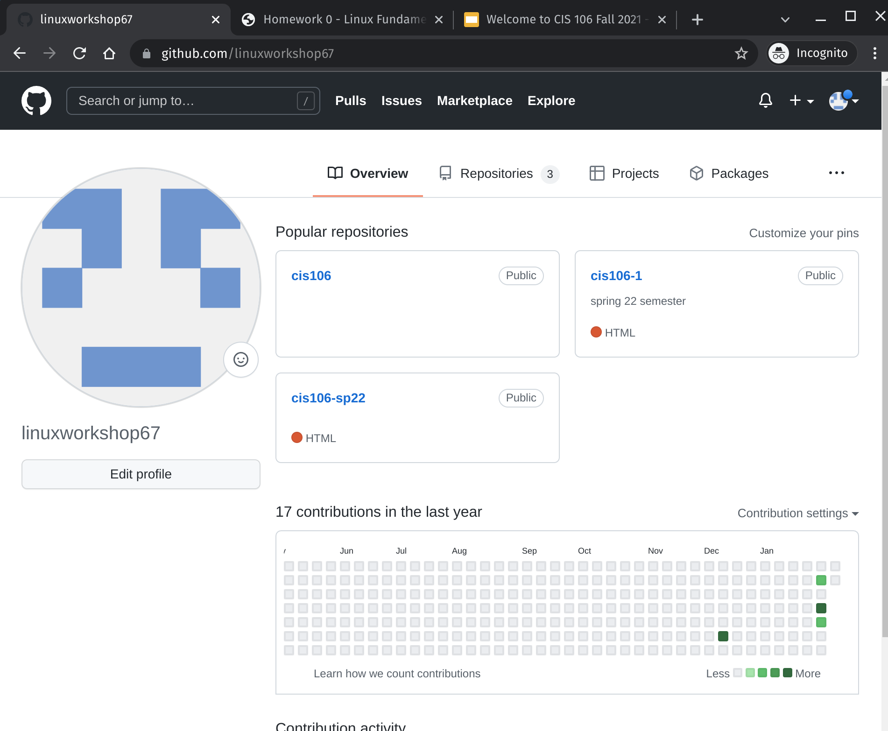

# Week Report 0
## Summary of Presentation: Introduction to CIS 106
* Linux is opensource.
* It is a required skill
* it is the largest collaboration project in humankind
* Course requirements

* Syllabus

## My github account

## Final Project Research: Pick a project
* Build a Tor Router 🌟🌟🌟
* Build a print server 🌟
* Build a camera server🌟🌟