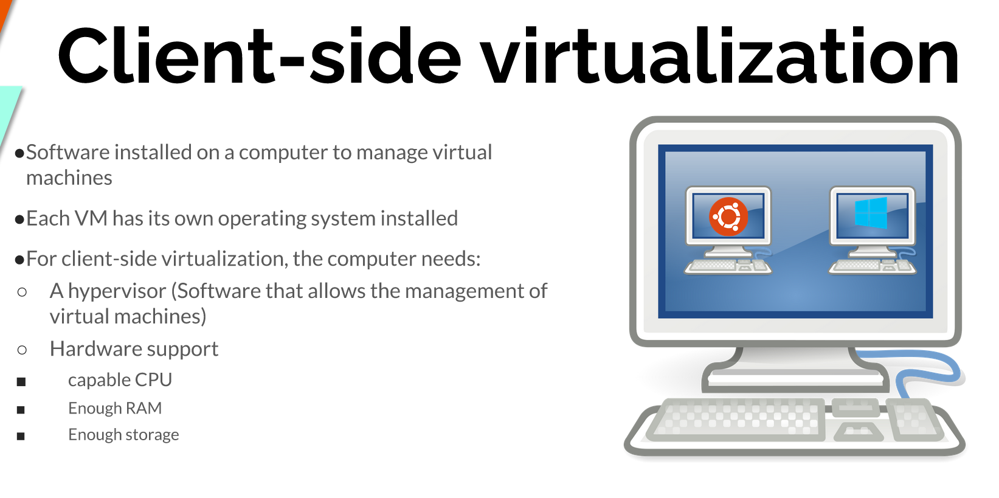
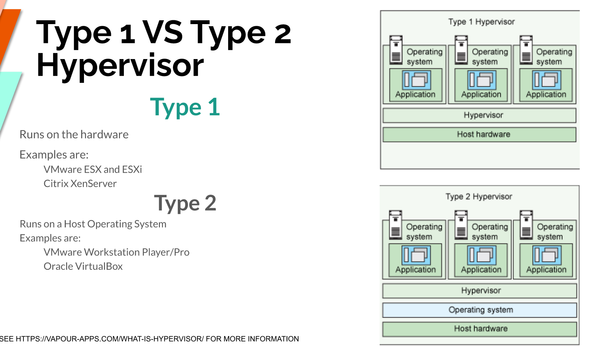
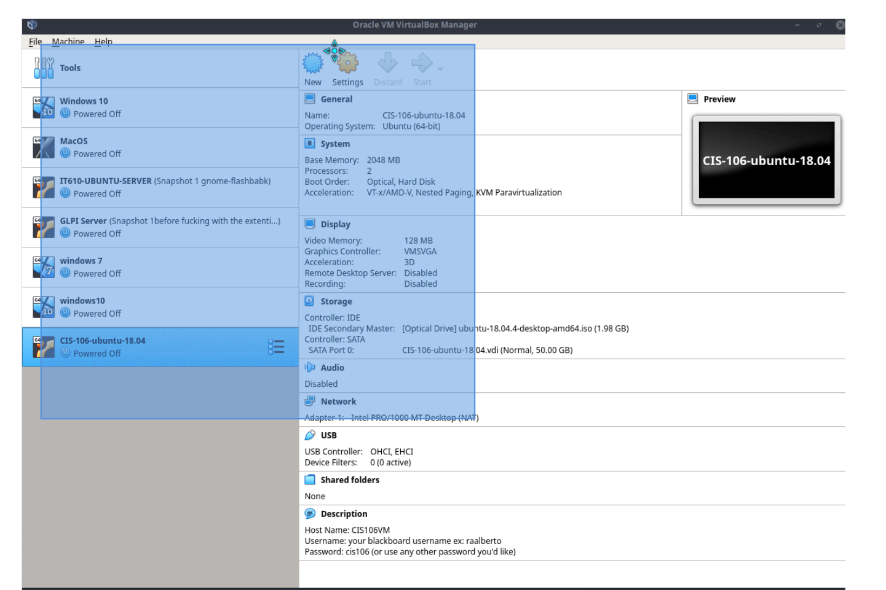
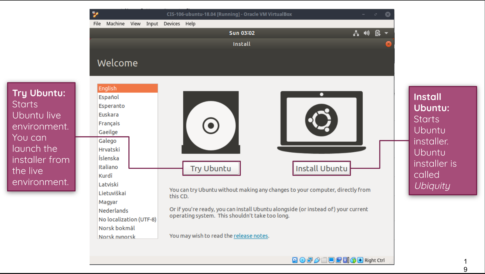
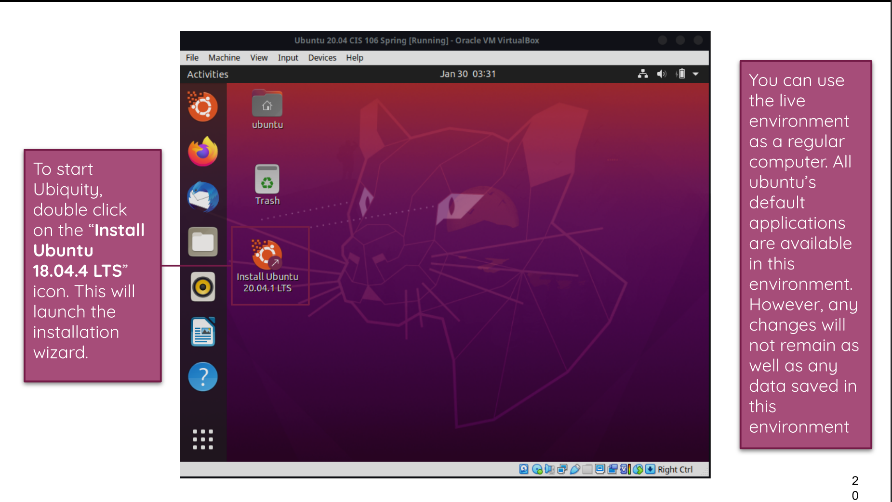
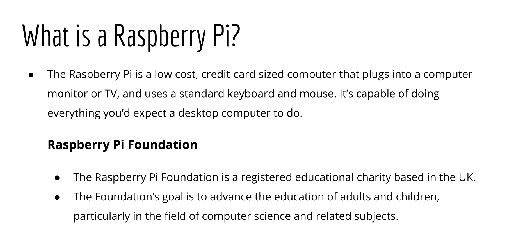
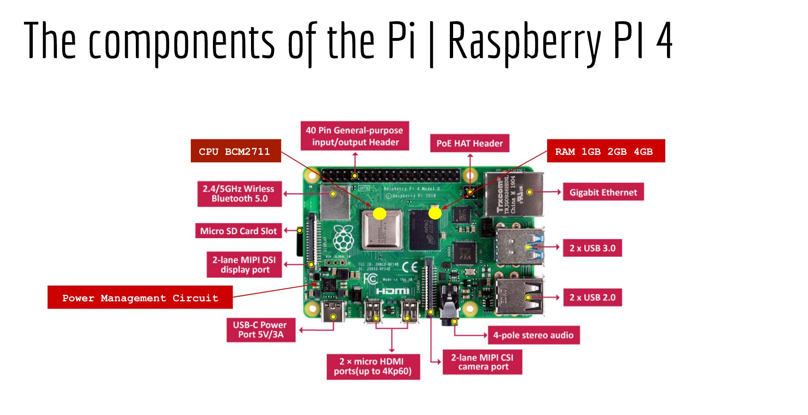

# Weekly Report 2
## Summary of Presentations
### The basics of Virtualization
* **What is virtualization** Replication of hardware to simulate virtual machines. 

* **Types of virtualization**
  * Server side
  * Client side

* **Benefits of Virtualization**
  * Allows running multiple OSs
  * Allows application sandboxing
  * Reduces hardware cost
 
### Installing Ubuntu
 
 
 
### What is the Raspberry Pi
* What is a raspberry pi

* Different models
  * Raspberry Pi 400
  * Raspberry Pi 4
  * Rasberry Pi 3
  * Raspberry Pi Zero W
  * Raspberry Pi 3 A+
  * Raspberry Pi 2
  * Raspberry Pi CMP
  * Raspberry Pi
* Specs of the latest model 

* 5 projects you can do in Build a DNS/DHCP server and ads blocker with the Pi
  * Pi-hole
  * Build a wireless access Point
  * Build a Tor Router
  * Build a print server
  * Build a camera server
  