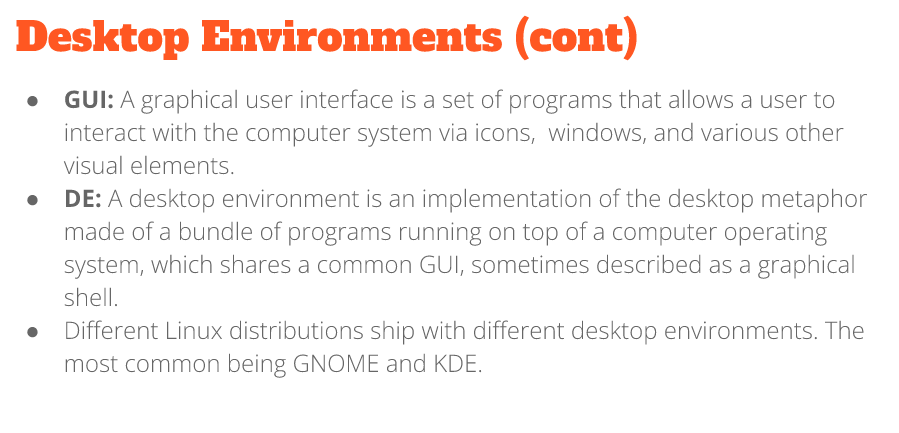

# Weekly Report 3

## Exploring Desktop Environments

Different desktop environments:
* Gnome
* Mate
* KDE
* XFCE
* Cinnamon
* Pantheon

Definitions of Gui and DE 
  

Common Elements of a DE:
* Desktop Settings
* Display Manager
* File Manager
* Icons
* Favortites Bar

## The bash shell

## Managing software

